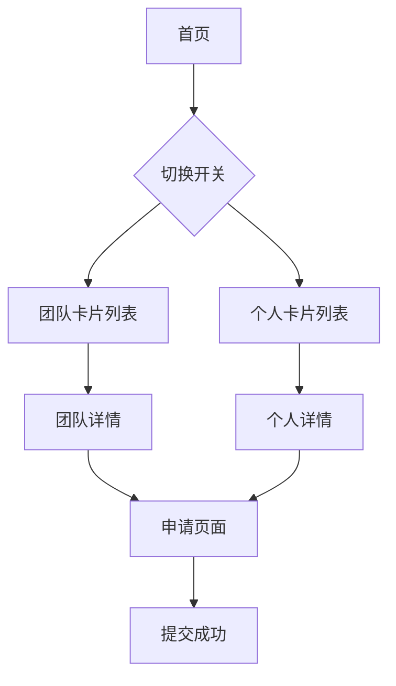

## 1. 产品概述
TeenList是一个专注于8-18岁青少年创造者与团队的精选名录平台。我们记录并连接这一代的年轻建造者，帮助他们找到自己的团队与同行者。

产品核心价值：为青少年创新者提供展示平台，促进同龄人之间的连接与合作。

## 2. 核心功能

### 2.1 用户角色
| 角色 | 注册方式 | 核心权限 |
|------|----------|----------|
| 访客用户 | 无需注册 | 浏览团队和个人资料、查看基本信息 |
| 申请者 | 表单提交 | 提交团队或个人申请、查看申请状态 |
| 管理员 | 后台邀请 | 审核申请、管理展示内容 |

### 2.2 功能模块
我们的青少年创造者名录包含以下主要页面：
1. **首页**：展示平台介绍、切换开关、团队/个人卡片列表
2. **申请页面**：团队申请表单、个人申请表单
3. **详情页面**：团队详细信息、个人详细信息

### 2.3 页面详情
| 页面名称 | 模块名称 | 功能描述 |
|----------|----------|----------|
| 首页 | 头部导航 | 显示TeenList logo、居中导航链接、右侧提交按钮 |
| 首页 | 英雄区域 | 展示主标题"TeenList，塑造明天"、副标题说明 |
| 首页 | 切换开关 | Teams/Organizations与Individuals分段控制器 |
| 首页 | 卡片列表 | 展示团队或个人卡片，支持懒加载 |
| 团队卡片 | 基本信息 | 显示logo、名称、描述、标签徽章 |
| 团队卡片 | 新闻动态 | 展示3条最新更新/链接，带外部链接图标 |
| 团队卡片 | 底部信息 | 创始人头像和姓名、社交媒体图标 |
| 个人卡片 | 视觉展示 | 大封面图或头像、姓名、角色、简介 |
| 个人卡片 | 技能标签 | 展示技能/兴趣标签 |
| 申请页面 | 团队表单 | 团队名称、描述、logo上传、成员信息、项目链接 |
| 申请页面 | 个人表单 | 姓名、年龄、技能、项目经历、联系方式 |

## 3. 核心流程

### 访客用户流程
用户访问首页 → 浏览英雄区域了解平台 → 通过切换开关选择查看团队或个人 → 浏览卡片列表 → 点击卡片查看详情 → 点击申请按钮提交申请

### 申请流程
用户点击提交按钮 → 选择团队或个人申请 → 填写相应表单 → 提交申请 → 等待审核结果

## 4. 用户界面设计

### 4.1 设计风格
- **主色调**：背景色 `#FBFBFD`，卡片白色 `#FFFFFF`，强调色 `#0071e3` (Apple蓝)
- **按钮样式**：圆角 `rounded-3xl` 或 `rounded-[2rem]`，柔和阴影 `box-shadow: 0 8px 40px rgba(0,0,0,0.08)`
- **字体**：系统无衬线字体 (SF Pro/Inter)，标题粗体紧凑，正文深灰色 `#1f2937`
- **布局风格**：极简主义，大量留白，卡片式布局
- **图标风格**：Material Symbols，简洁线性风格

### 4.2 页面设计概述
| 页面名称 | 模块名称 | UI元素 |
|----------|----------|--------|
| 首页 | 头部导航 | 左侧TeenList logo，居中导航链接，右侧蓝色提交按钮 |
| 首页 | 英雄区域 | 居中大字体标题，浅灰色副标题，充足留白 |
| 首页 | 切换开关 | 灰色背景分段控制器，白色活动标签带阴影 |
| 团队卡片 | 容器 | 白色背景，`rounded-[2rem]`圆角，`p-8`内边距，柔和阴影 |
| 团队卡片 | 头部 | 左上角`rounded-xl` logo，`w-12 h-12`尺寸，右侧标题和描述 |
| 团队卡片 | 标签 | 灰色背景徽章，圆角设计，浅灰色文字 |
| 个人卡片 | 布局 | 竖版肖像样式，顶部大封面图或头像 |

### 4.3 响应式设计
- 采用桌面优先设计策略
- 移动端自适应，保持核心功能完整
- 触摸交互优化，按钮尺寸适配移动端

### 4.4 与wait.html保持一致性
- 保留现有的语言切换功能
- 维持AstraCore量子星辰的品牌标识
- 保持版权声明和外部链接规范
- 延续现有的字体和基础样式规范