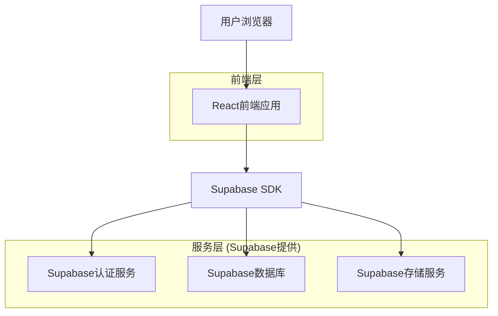
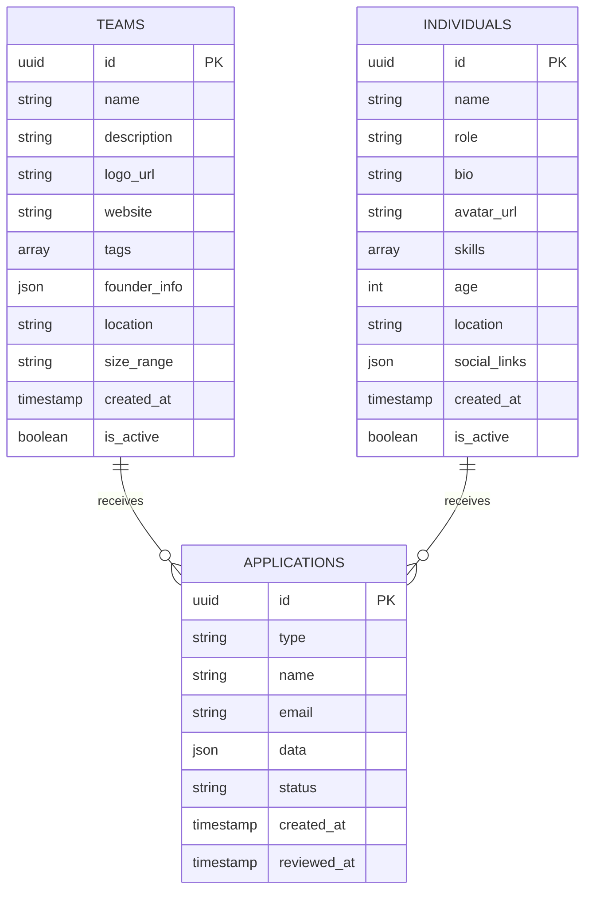

## 1. 架构设计



## 2. 技术栈描述

- **前端**: React@18 + TailwindCSS@3 + Vite
- **初始化工具**: vite-init
- **后端**: Supabase (BaaS)
- **数据库**: Supabase PostgreSQL
- **存储**: Supabase对象存储
- **UI组件**: HeadlessUI (用于切换开关等交互组件)

## 3. 路由定义

| 路由 | 用途 |
|------|------|
| / | 首页，展示平台介绍和卡片列表 |
| /submit | 申请页面，团队和个人申请表单 |
| /team/:id | 团队详情页面，展示团队完整信息 |
| /individual/:id | 个人详情页面，展示个人信息 |
| /wait | 等待页，保留现有wait.html内容 |

## 4. API定义

### 4.1 核心API (通过Supabase SDK)

**获取团队列表**
```
GET /api/teams
```

请求参数:
| 参数名 | 参数类型 | 是否必需 | 描述 |
|--------|----------|----------|------|
| limit | number | false | 返回数量限制 |
| offset | number | false | 偏移量 |
| category | string | false | 分类筛选 |

响应:
| 参数名 | 参数类型 | 描述 |
|--------|----------|------|
| data | array | 团队数据数组 |
| count | number | 总数 |

**获取个人列表**
```
GET /api/individuals
```

请求参数和响应格式与团队列表类似。

**提交申请**
```
POST /api/applications
```

请求:
| 参数名 | 参数类型 | 是否必需 | 描述 |
|--------|----------|----------|------|
| type | string | true | 申请类型: 'team' 或 'individual' |
| name | string | true | 名称 |
| description | string | true | 描述 |
| email | string | true | 联系邮箱 |
| data | object | true | 其他申请数据 |

## 5. 数据库架构

### 5.1 数据模型定义



### 5.2 数据定义语言

**团队表 (teams)**
```sql
-- 创建团队表
CREATE TABLE teams (
    id UUID PRIMARY KEY DEFAULT gen_random_uuid(),
    name VARCHAR(255) NOT NULL,
    description TEXT NOT NULL,
    logo_url TEXT,
    website TEXT,
    tags TEXT[],
    founder_info JSONB,
    location VARCHAR(100),
    size_range VARCHAR(50),
    created_at TIMESTAMP WITH TIME ZONE DEFAULT NOW(),
    is_active BOOLEAN DEFAULT true
);

-- 创建索引
CREATE INDEX idx_teams_created_at ON teams(created_at DESC);
CREATE INDEX idx_teams_location ON teams(location);
CREATE INDEX idx_teams_tags ON teams USING GIN(tags);
```

**个人表 (individuals)**
```sql
-- 创建个人表
CREATE TABLE individuals (
    id UUID PRIMARY KEY DEFAULT gen_random_uuid(),
    name VARCHAR(255) NOT NULL,
    role VARCHAR(255) NOT NULL,
    bio TEXT NOT NULL,
    avatar_url TEXT,
    skills TEXT[],
    age INTEGER CHECK (age >= 8 AND age <= 18),
    location VARCHAR(100),
    social_links JSONB,
    created_at TIMESTAMP WITH TIME ZONE DEFAULT NOW(),
    is_active BOOLEAN DEFAULT true
);

-- 创建索引
CREATE INDEX idx_individuals_created_at ON individuals(created_at DESC);
CREATE INDEX idx_individuals_age ON individuals(age);
CREATE INDEX idx_individuals_skills ON individuals USING GIN(skills);
```

**申请表 (applications)**
```sql
-- 创建申请表
CREATE TABLE applications (
    id UUID PRIMARY KEY DEFAULT gen_random_uuid(),
    type VARCHAR(20) NOT NULL CHECK (type IN ('team', 'individual')),
    name VARCHAR(255) NOT NULL,
    email VARCHAR(255) NOT NULL,
    data JSONB,
    status VARCHAR(20) DEFAULT 'pending' CHECK (status IN ('pending', 'approved', 'rejected')),
    created_at TIMESTAMP WITH TIME ZONE DEFAULT NOW(),
    reviewed_at TIMESTAMP WITH TIME ZONE
);

-- 创建索引
CREATE INDEX idx_applications_created_at ON applications(created_at DESC);
CREATE INDEX idx_applications_status ON applications(status);
CREATE INDEX idx_applications_type ON applications(type);
```

### 5.3 Supabase访问权限设置

```sql
-- 授予匿名用户读取权限
GRANT SELECT ON teams TO anon;
GRANT SELECT ON individuals TO anon;

-- 授予认证用户所有权限
GRANT ALL PRIVILEGES ON teams TO authenticated;
GRANT ALL PRIVILEGES ON individuals TO authenticated;
GRANT ALL PRIVILEGES ON applications TO authenticated;

-- 创建行级安全策略
ALTER TABLE teams ENABLE ROW LEVEL SECURITY;
ALTER TABLE individuals ENABLE ROW LEVEL SECURITY;
ALTER TABLE applications ENABLE ROW LEVEL SECURITY;

-- 创建策略规则
CREATE POLICY "公开读取活跃团队" ON teams FOR SELECT USING (is_active = true);
CREATE POLICY "公开读取活跃个人" ON individuals FOR SELECT USING (is_active = true);
CREATE POLICY "认证用户可以提交申请" ON applications FOR INSERT WITH CHECK (true);
```

## 6. 部署配置

### 6.1 环境变量
```
VITE_SUPABASE_URL=your_supabase_url
VITE_SUPABASE_ANON_KEY=your_supabase_anon_key
VITE_SITE_URL=https://teenlist.org
```

### 6.2 构建配置
- 使用Vite进行项目构建
- 支持TypeScript
- 配置TailwindCSS用于样式处理
- 集成Supabase客户端SDK